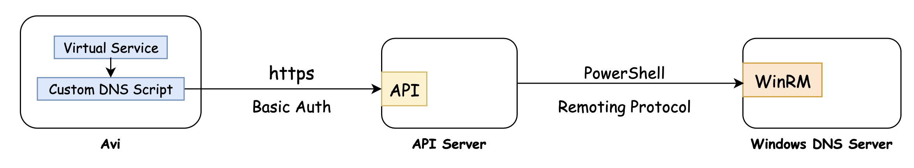
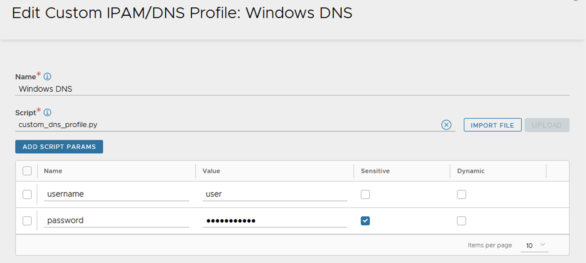

# AVI Windows DNS API

API server for updating DNS records in Windows DNS Server using Custom DNS profile in Avi.

## Flow diagram
Avi makes REST API calls while creation / deletion of Virtual Services with details of the DNS record. After authenticating the API call, API server updates the records in the Windows Server.



## Windows DNS server
- Check and ensure that PowerShell modules for DNS server is available

    ```
    > Get-Module DNSServer -ListAvailable
    ```
- Ensure Windows Remote Management (WinRM)services is running and port tcp/5985 is allowed on the firewall

    ```
    > Get-Service -Name WinRM
    ```

## Deploy API server
- The API server can be deployed as a docker container using the docker compose file available [here](https://gitlab.eng.vmware.com/rramamoorthy/avi-windns-api/-/tree/main/docs/docker-compose)
- Create a SSL certificate, self-signed can also be used, and update the `cert.pem` and `key.pem` files.
- Update the `.env` file with the required parameters
  ```
  # Username and password for authentication to API server
  BASIC_AUTH_USERNAME=
  BASIC_AUTH_PASSWORD= 

  # DNS server host and credential with authorization to update DNS recods
  WIN_SRV_HOST=
  WIN_SRV_PASSWORD=
  WIN_SRV_USERNAME=
  ```

## Custom DNS script
- The script to be used while creating Custom DNS profile in AVI can be is available [here](https://gitlab.eng.vmware.com/rramamoorthy/avi-windns-api/-/tree/main/docs/custom-script)

- Import and upload the script in Avi to create a custom DNS profile with the following script parameters



